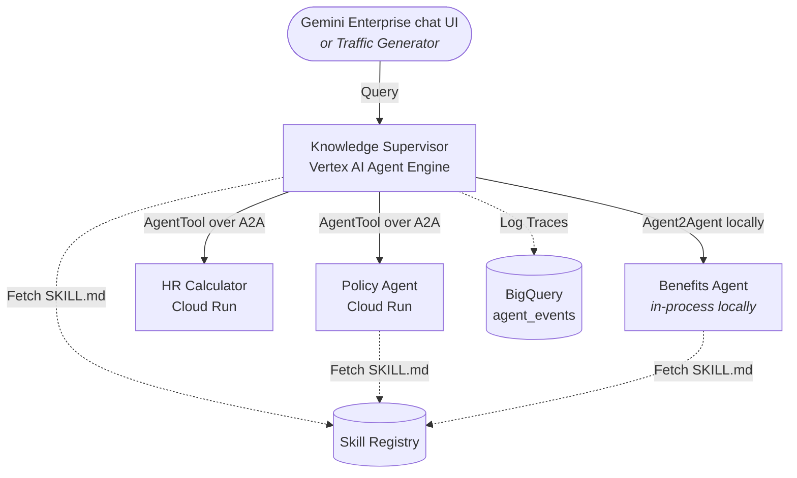

# Design: Agent Quality Lab

> **Scope note:** This design doc covers the full quality-loop vision,
> including the reactive/remediation loop. This repo ships the skill
> evolution loop; the reactive loop lives in the original
> agent-quality-lab project and is described here for design context.


Single source of truth for architecture, agent design, quality pipeline,
and implementation status.

---

## 1. Overview

A multi-agent knowledge supervisor deployed on Google Cloud, with
automated quality measurement, CI/CD quality gates, and AI agents that
drive improvements -- stopping to ask when the fix isn't theirs to make.

The project has two demo versions:

| Track | Approach | Docs |
|-------|----------|------|
| **Reactive Loop** | Find bugs one at a time, create GitHub Issues, fix with narrow PRs | [docs/reactive-loop/](reactive-loop/) |
| **Skill Evolution** | Analyze execution trajectories in parallel, distill into comprehensive ADK skill documents | [docs/skill-evolution/](skill-evolution/) |

The Reactive Loop is complete and demonstrable. Skill Evolution builds
on the same infrastructure (BigQuery, GitHub, CI gates, A2A agents) and
replaces the flat `prompts.py` with ADK `SKILL.md` directories that
evolve automatically from production traffic.

### Context

Continues the blog post
["Your Agent Can Fix Its Own Prompt"](https://medium.com/google-cloud/your-agent-can-fix-its-own-prompt-heres-how).
That post proved a closed-loop cycle for a single agent: 64% to 99% in
one automated cycle.

This project answers: what happens when the agent becomes a multi-agent
supervisor with sub-agents deployed as separate services? What changes
in the failure modes, the improvement workflow, and the CI/CD pipeline?

**Reactive Loop** answered that question with a reactive loop: Quality
Agent finds one problem, Remediation Agent fixes it, human reviews the PR.

**Skill Evolution** goes further: instead of fixing problems one at a
time, the system collects execution trajectories, dispatches a parallel
fleet of analyst agents, and consolidates their findings into a
comprehensive skill document. Based on
[Trace2Skill](https://arxiv.org/abs/2603.25158) and
[AutoSkill](https://arxiv.org/abs/2603.01145). See
[docs/skill-evolution/RESEARCH.md](skill-evolution/RESEARCH.md) for
paper analysis.

See [Section 11](#11-implementation-status) for what's built and where
to go next.

### What's Different From Blog Post 1

| Dimension | Blog 1 (Single Agent) | This Project (Multi-Agent) |
|-----------|----------------------|---------------------------|
| Agent | Single LlmAgent | Supervisor + 2 A2A sub-agents |
| Deployment | Local / in-process | Agent Engine + Cloud Run |
| Failure modes | Prompt gaps only | Routing + overlap + scope + hallucination |
| Improvement | Vertex AI Prompt Optimizer | AI agents + human-in-the-loop via GitHub |
| Prompt management | Prompt Registry | `SKILL.md` in git (changes via PRs) |
| Scope | Implicit | Explicit (`agent_context.json`) |
| Traceability | Log files | Git PRs + CI quality gates |

### The System Lifecycle

The system has three phases. Each has a different goal, different data
sources, and a different role for the Quality Agent.

**Act 1 -- Bootstrap (getting from bad to good):**
Deploy an agent with a deliberately minimal skill. Use Golden Q&A to
power adversarial traffic (Alex) and scoring (LLM Judge). Run the
evolution loop until quality stabilizes. Quality Agent does scoring
only -- no issue reporting, because you know it's bad.

**Act 2 -- Production monitoring (maintaining quality):**
The evolved skill is deployed and performing well. Quality Agent runs
daily, scoring real production sessions against Golden Q&A ground
truth and using the CA Data Agent to search for regressions. Three
failure types emerge: regressions (urgent, remediation agent),
persistent gaps (accumulate for evolution), and new topics (human
decision needed).

**Act 3 -- Production evolution (healing autonomously):**
Quality issues accumulate until the Evolution Agent triggers (>= 10
issues or weekly schedule). It downloads the quality report from GCS,
runs the analyst fleet on real failure data, and produces a PR with
an evolved SKILL.md. Human reviews, merges, agents redeploy.

**Growing the ground truth:**
Golden Q&A is not static. New-topic issues surface questions the system
can't handle. Humans add these to Golden Q&A, re-run
`extract_ground_truth.py`, and the next evolution cycle has tighter
scoring. Evolution can still improve on topics without Golden Q&A
coverage (using general quality signals), but with lower confidence.

See [docs/skill-evolution/README.md](skill-evolution/README.md) for the
full narrative with diagrams.

---

## 2. Architecture



- The **supervisor** is the root agent on Vertex AI Agent Engine. It
  wraps each specialist as an `AgentTool`, so a compound question fans
  out to several specialists in one turn and the answers are
  synthesized into a single response.
- **Policy Agent** answers company-policy questions on Cloud Run behind
  an A2A endpoint, using tool-based lookups. Its `SKILL.md` is the main
  evolution target. A **Benefits Agent** skill is seeded in the registry
  and joins the topology when its service is deployed.
- **HR Calculator** computes PTO balances and working days with
  deterministic tools; it has no skill to evolve.
- Skill-bearing agents call the **Skill Registry** at startup
  (`GetSkill`, newest revision) and fall back to the packaged file on
  any failure. The startup log line
  `Loaded skill from registry <id> (revision <sha>)` is the live proof
  of which revision serves traffic.
- The supervisor's **BigQuery Agent Analytics plugin** logs every event
  to the `agent_events` table, tagged with the skill version from the
  SKILL.md frontmatter (`custom_tags.agent_version`).

### Production Agents

| Agent | Runtime | Purpose |
|-------|---------|---------|
| Knowledge Supervisor | Agent Engine | Routes queries to sub-agents |
| Policy Agent | Cloud Run (A2A) | Policy lookups (6 topics) |
| HR Calculator | Cloud Run (A2A) | Date math, PTO balance, holidays |

### Quality & Operations Agents

| Agent | Runtime | Purpose |
|-------|---------|---------|
| Quality Agent | Cloud Run Job (scheduled) | Monitors quality, creates GitHub Issues with recommendations |
| Skill Evolution Agent | Cloud Run Job / GitHub Actions / local | Evolves SKILL.md from quality issues and trajectories, creates PRs |
| Knowledge Manager | Local / Cloud Run | Business person's interface to the system |

### Infrastructure

| Component | Purpose |
|-----------|---------|
| BigQuery | Session logging (Agent Analytics Plugin) |
| BigQuery Conversational Analytics | Natural language queries over session history (regression detection, similar query lookup) |
| Traffic Generator | Generate + run synthetic traffic (Cloud Run Job / local) |
| Cloud Scheduler | Triggers Quality Agent daily at 08:00 UTC |

### How a question flows (Agent Engine, AgentTool, A2A)

Three pieces of vocabulary, then the lifecycle:

- **Vertex AI Agent Engine** is the managed runtime hosting the root
  agent: it owns sessions (multi-turn memory), scaling, and the
  `stream_query` API that clients call. The supervisor lives here so
  conversations survive across turns without any server of our own.
- **A2A (Agent2Agent protocol)** is the open HTTP protocol agents use
  to call each other. Each specialist is an independent Cloud Run
  service exposing an A2A endpoint with an agent card describing what
  it can do — the supervisor talks to specialists the same way any
  external agent could.
- **AgentTool** is the ADK wrapper that presents a whole remote agent
  to the supervisor's LLM as a callable tool. Routing is therefore implemented as
  tool-calling: the model picks specialists the way it picks any tool,
  which lets it call several in a single turn.

Lifecycle of one compound question ("Compare my meal limit with the
HSA contribution"):

1. The client calls the supervisor's Agent Engine endpoint
   (`stream_query`) inside a session.
2. `knowledge_supervisor`'s LLM reads its `SKILL.md` (fetched from the
   Skill Registry at startup) and plans: this needs `policy_agent`
   (meal limit) AND `benefits_agent` (HSA).
3. It emits two AgentTool calls. Each becomes an A2A HTTP request to
   that specialist's Cloud Run service.
4. Each specialist is a full ADK agent of its own: it loads its own
   `SKILL.md`, runs its own LLM turn, calls its own tools
   (`lookup_company_policy`, calculators), and returns its answer over
   A2A.
5. The supervisor synthesizes the specialist answers into one response
   and streams it back.
6. Every hop — supervisor turns, tool calls, specialist sessions — is
   logged to BigQuery by the analytics plugins, version- and
   label-tagged. This trace is what the quality and evolution agents
   read.

Why this topology: specialists deploy, scale, and **evolve
independently** (each has its own SKILL.md and registry entry);
failures surface at an ownership boundary (the bottleneck stage
attributes each failure to supervisor routing vs a specialist's
knowledge); and the supervisor stays thin — a router with conventions
rather than an agent that knows everything.

### The evolution loop, stage by stage

1. **Traffic** -- real users (or the traffic generator's simulated
   users) talk to the deployed supervisor; specialists answer through
   it.
2. **Traces** -- every turn lands in BigQuery, version-tagged, so each
   evolution round analyzes only traffic from the currently deployed
   skill.
3. **Scheduled analysis** -- Cloud Scheduler fires the evolution job.
   It builds a quality report from the BigQuery window
   (`QUALITY_SOURCE=bigquery`), proceeds only past a failure-count
   gate, attributes failures to the responsible agent, runs the
   analyst fleet, and scores best-of-N candidate skills on the evolve
   set.
4. **Publish** -- winning skills are pushed to the Skill Registry as
   new revisions, and a pull request with the evolved `SKILL.md` opens
   on this repo (the job token-clones the repo inside its container).
5. **CI adjudicates** -- the Eval & Load Test Gate runs golden evals
   and a load test on the PR. The gate is version-aware: baseline V0
   skills are held to baseline expectations, while an evolved skill
   (version >= 1) must pass the full routing, fan-out, and quality
   assertions. A candidate that gamed its evolve-set score is rejected here,
   in the PR record, before it ever serves traffic.
6. **Merge activates** -- merging triggers `deploy.yml`: it re-seeds
   the registry from the merged `SKILL.md` (normally a SKIP because
   the job already pushed that exact revision -- the SKIP is the
   git-to-registry reconciliation proof), then redeploys the agents.
7. **The loop closes** -- restarted agents fetch the merged revision,
   the next traffic window measures the new version under its own
   `agent_version` tag, and the next scheduled run starts from clean
   data.

Rollback is one command
(`scripts/demo/skill_evolution/rollback_demo.sh`): V0 is republished as
the newest registry revision and the agents restart onto it, while the
evolved revisions stay in the append-only history.

### Components in detail

**Enterprise agents** (`agents/enterprise/`) — serve end users:

- **knowledge_supervisor** — the root agent on Vertex AI Agent Engine.
  Receives every user question, fans out to specialists as `AgentTool`
  calls, and synthesizes one answer. Its thin `SKILL.md` holds routing
  conventions. The BigQuery Analytics plugin rides here, logging every
  event. Key files: `app/agent.py`, `app/skill/SKILL.md`.
- **policy_agent** — company-policy specialist on Cloud Run behind an
  A2A endpoint. Answers PTO, sick leave, remote work, expenses, and
  holiday questions with the `lookup_company_policy` tool over the
  policy corpus. Its `SKILL.md` is the primary evolution target — the
  V0 baseline deliberately blocks the tool (baked facts + defer-to-HR)
  and parrots corrections. Key files: `agent.py`, `tools.py`,
  `skill_loader.py`, `skill/SKILL.md`.
- **hr_calculator** — deterministic math specialist on Cloud Run:
  PTO balances, working days for date ranges, disability pay. Pure
  tools, no skill to evolve. Key file: `agent.py`.
- **benefits_agent** — benefits specialist defined by its skill
  (`skill/SKILL.md`). Runs in-process in the local topology and is
  seeded into the Skill Registry; joins the deployed topology when a
  service for it exists.

**Workflow agents** (`agents/workflow/`) — test, monitor, and evolve
the stack:

- **traffic_generator** — produces synthetic traffic: single-turn
  question sets, scripted multi-turn corrections (the user pushes back
  with a wrong figure), and a Golden-Q&A-aware adversarial user
  simulator. Targets the local supervisor or the deployed Agent Engine.
  Key files: `main.py`, `user_simulator.py`.
- **quality_agent** — the daily sentinel (Cloud Run Job + Scheduler).
  Pulls recent BigQuery sessions filtered by `agent_version`, scores
  them with the LLM judge against Golden Q&A, and files GitHub issues
  for failures. Key files: `main.py`, `tools.py`, `quality_report.py`.
- **skill_evolution_agent** — the healer (Cloud Run Job; triggered
  on demand, by quality-issue threshold, or by its scheduled tick —
  weekly by default). One run: quality report from BigQuery → failure-count
  gate → bottleneck attribution (which agent caused each failure) →
  agentic analysts investigate each failure with tool access → patch
  scoring and consolidation → best-of-N candidate skills scored on the
  evolve set → winners pushed to the Skill Registry → PR opened. Key
  files: `evolve.py` (core pipeline), `coevolve.py` (multi-agent
  orchestration), `bottleneck.py`, `agentic_analyst.py`,
  `patch_scoring.py`, `tools.py` (registry push + PR), `main.py` (CLI).

**Supporting pieces:**

- **`skill_loader.py`** — loads `SKILL.md` from the Skill Registry
  (newest revision) or the packaged file; exposes the frontmatter
  version that tags BigQuery events and drives the version-aware gate.
- **`eval/skill_evolution/registry_sync.py`** — Skill Registry CLI:
  `seed` (idempotent V0 publish), `push`, `revisions`, `verify-read`.
- **`eval/scoring/`** — `score_conversations.py` (SDK scorer: turn
  tagging, golden matching, quality report), `llm_judge.py` (the gate
  and load-test judge), `triage_report.py` (failure taxonomy + owner
  routing), `extract_ground_truth.py`.
- **`eval/tests/`** — the CI gate: `test_eval.py` (routing, compound
  fan-out, out-of-scope) and `test_load.py` (fresh-traffic quality,
  error rate, latency budgets), both version-aware via
  `skill_is_baseline()`.

### The full cycle, actor by actor

Every stage of the loop, who runs it, and how to watch it live:

| Stage | Actor (code) | Trigger | Reads | Writes | Watch it |
|---|---|---|---|---|---|
| Serve | `knowledge_supervisor` (Agent Engine) + `policy_agent`/`hr_calculator` (Cloud Run, A2A) | user / API call | Skill Registry (SKILL.md at startup), tools | the answer | `bash scripts/test/smoke_test_deployed.sh` |
| Observe | BigQuery Analytics plugins (in each agent) | every event | — | `agent_logs.agent_events`, tagged version + labels | `bash scripts/test/show_traces.sh` (label distribution / selector preview) |
| Detect | `quality_agent` (Cloud Run Job) | daily 08:00 UTC scheduler, or `gcloud run jobs execute quality-agent` | BQ window, golden eval spec | quality report (GCS) + labeled GitHub issues | `gh issue list`; job logs |
| Learn | `skill_evolution_agent` (Cloud Run Job) | on demand / issue threshold / weekly tick | BQ traces (selector), golden spec | evolved SKILL.md candidates, scores, regression cases | the "Inside one run" table in [Step 3 of the deployed walkthrough](skill-evolution/DEMO_SCRIPT.md#step-3--run-the-evolution-job) |
| Propose | same job, final stage | end of a successful run | run artifacts | Skill Registry revision + the PR (skill + eval cases + selector) | `gh pr list` |
| Adjudicate | Eval & Load Test Gate (GitHub Actions) | the PR | repo skills at PR state | green/red checks; branch protection blocks red | `gh pr checks <n>` |
| Activate | Deploy to GCP workflow (GitHub Actions, WIF) | PR merge | merged repo | registry sync + redeploy; agents fetch the new revision | `gcloud logging read 'textPayload:"Loaded skill from registry"'` |
| Roll back | `rollback_demo.sh` | you | SKILL.v0 files | V0 as newest registry revision; agents restarted | script prints verification |

---

## 3. The Starting Point

The Policy Agent starts with a deliberately naive baseline. The original
design expressed it as a flat prompt (`prompts.py`, shown below); the
current repo expresses the same idea as the v0 `SKILL.md`
(`agents/enterprise/policy_agent/skill/SKILL.md`, `version: "0"`):

```
You are a helpful company information assistant.

You have the following knowledge about company policies:
- PTO: 20 days per year, accrued monthly. Up to 5 unused days roll over.
- Sick leave: 10 days per year, does not roll over.
- Remote work: Up to 3 days per week with manager approval.
- Benefits: The company offers competitive benefits.

Answer questions using only the information above. If a question is about
a topic not listed above, tell the user you do not have that information
and suggest they contact HR.
```

**Deliberate flaws:**
1. Embeds knowledge in prompt text (discourages tool use)
2. Lists only 4 of 6 topics (no expenses or holidays)
3. Vague on benefits ("competitive" -- no specifics)
4. Instructs the agent to refuse unknown topics instead of looking them up

**Result:** ~35% unhelpful responses. The agent says "contact HR" for
questions about expenses, benefits details (401k, parental leave, dental),
and holidays -- even though `lookup_company_policy` covers all of them.

The fix is a PR that rewrites the agent's `SKILL.md`. The skill is
code -- versioned, diffable, reviewable.

---

## 4. Three Knowledge Layers

The system's knowledge is organized in three layers. Each has a different
owner, update frequency, and purpose.

```
+-----------------------------------------------------------+
|  Layer 1: Domain Knowledge                                |
|  What the system KNOWS (ground truth)                     |
|                                                           |
|  policy_agent/tools.py  -> COMPANY_POLICIES dict          |
|  hr_calculator/tools.py -> calculation logic              |
|                                                           |
|  Owner: engineers                                         |
|  Changes: code PRs                                        |
+---------------------------+-------------------------------+
                            |
+---------------------------v-------------------------------+
|  Layer 2: Expected Behavior                               |
|  What the system SHOULD DO (test suite)                   |
|                                                           |
|  eval/data/eval_cases.json    -> golden Q&A pairs              |
|    in-scope: question + expected agent + expected tool    |
|    out-of-scope: question + "decline_gracefully"          |
|                                                           |
|  Owner: Knowledge Manager + engineers                     |
|  Changes: PRs (from agents or humans)                     |
|  Grows from: production failures + human feedback         |
+---------------------------+-------------------------------+
                            |
+---------------------------v-------------------------------+
|  Layer 3: Decisions & Context                             |
|  WHY the system behaves this way (institutional memory)   |
|                                                           |
|  eval/data/agent_context.json                                  |
|    scope_decisions:     what's in/out and why             |
|    routing_decisions:   which agent handles what          |
|    known_limitations:   data gaps, partial answers        |
|    past_fixes:          what was tried, what worked       |
|                                                           |
|  Owner: Knowledge Manager (from human input)              |
|          + Remediation Agent (from fix outcomes)                 |
|  Changes: PRs                                             |
+-----------------------------------------------------------+
```

### How the layers interact

- **Quality Agent** reads Layer 3 (scope decisions) to score correctly
- **Remediation Agent** reads Layer 2 + 3 before proposing fixes
- **Knowledge Manager** reads all three, can update Layer 2 + 3
- **Quality Gate (CI)** runs Layer 2 (eval cases) as regression tests

---

## 5. Agent Context (Shared Memory)

`eval/data/agent_context.json` is the system's shared memory. It captures
decisions that aren't obvious from the code alone.

```json
{
  "last_updated": "2026-05-06",
  "last_updated_by": "quality-agent/issue-remediation PR #8",

  "scope_decisions": [
    {
      "topic": "stock_options",
      "decision": "out_of_scope",
      "reason": "No tool or data source; legal concern about guessing",
      "decided_by": "human",
      "source": "issue #12 comment by @business_person",
      "date": "2026-05-05"
    }
  ],

  "routing_decisions": [
    {
      "pattern": "next holiday",
      "route_to": "hr_calculator",
      "reason": "User wants the next date, not the full list",
      "decided_by": "human",
      "source": "issue #14 comment by @product_manager",
      "date": "2026-05-06"
    }
  ],

  "known_limitations": [
    {
      "description": "Policy data does not specify what kind of doctor's note",
      "impact": "Questions about doctor's note specifics get partial answers",
      "source": "quality report cycle 1",
      "date": "2026-05-05"
    }
  ],

  "past_fixes": [
    {
      "issue": "#5",
      "pr": "#6",
      "summary": "Rewrote prompt to enforce tool-first, added all 6 topics",
      "result": "64% -> 99% meaningful",
      "date": "2026-05-05"
    }
  ]
}
```

### Who reads what

| Section | Quality Agent | Remediation Agent | Knowledge Manager |
|---------|---------------|-------------|-------------------|
| `scope_decisions` | Yes (LLM judge) | Yes (avoid conflicts) | Yes (answer scope questions) |
| `routing_decisions` | No | Yes (avoid repeats) | Yes (explain routing) |
| `known_limitations` | No | Yes (don't fix unfixable) | Yes (set expectations) |
| `past_fixes` | No | Yes (don't repeat failures) | Yes (explain history) |

### How it gets updated

Business people don't edit JSON. They comment on GitHub Issues. The
Remediation Agent (or Knowledge Manager) reads their comments, interprets
the decision, and updates `agent_context.json` in a PR.

```
Business person comments on Issue #12:
  "Stock options are intentionally out of scope. We don't have
   that data and legal doesn't want us guessing."

Remediation Agent reads the comment, opens PR #13:
  - agent_context.json: adds stock_options to scope_decisions
  - eval_cases.json: adds out-of-scope test case
  - PR description: "scope: mark stock_options out-of-scope (fixes #12)"
```

---

## 6. Knowledge Manager Agent

The business person's interface to the system. They talk to this agent
to understand coverage, define boundaries, verify behavior, and
discover gaps. The agent manages Layers 2 and 3.

### Tools

| Tool | What it does |
|------|-------------|
| `query_supervisor` | Sends a question to the live knowledge_supervisor, returns actual response + which agent + which tool |
| `check_coverage` | Given a topic or question: is there an eval case? A scope decision? What does the domain data say? |
| `add_eval_case` | Adds a golden Q&A to `eval_cases.json` (via PR) |
| `add_scope_decision` | Records a scope decision in `agent_context.json` (via PR) |
| `read_context` | Reads `agent_context.json` -- scope, routing, limitations, past fixes |
| `create_issue` | Creates a GitHub Issue when a gap or incorrect behavior is found |
| `run_quality_check` | Runs a question through the supervisor and scores the response |

### Example conversations

**Coverage audit:**
```
Business: "What do we cover?"
Agent:    "IN SCOPE: PTO, sick leave, remote work, expenses, benefits
           (health, dental, vision, 401k, parental leave), holidays,
           PTO balance calculations, working days, next holiday.
           OUT OF SCOPE: stock options, salary bands, promotions,
           IT support, office locations.
           GAPS: No test cases for expenses or holidays yet."
```

**Behavior verification:**
```
Business: "If someone asks about parental leave, what happens?"
Agent:    [calls query_supervisor with the question]
          "Routes to policy_agent, looks up benefits, returns:
           16 weeks primary, 8 weeks secondary. No test case
           for this yet. Want me to add one?"
```

**Gap discovery:**
```
Business: "We added tuition reimbursement. Make sure it works."
Agent:    [calls query_supervisor with "What's the tuition policy?"]
          "The system can't answer this -- policy data doesn't include
           tuition. Options: (1) add it to the data, (2) mark out of scope.
           Created Issue #20."
```

**Setting boundaries:**
```
Business: "Never answer questions about individual compensation."
Agent:    [tests variations, records scope decision, adds eval cases]
          "Recorded. Tested 3 variations -- the system currently
           [declines correctly / hallucinates]. Created Issue #21."
```

---

## 7. Quality Agent

Runs on a schedule (Cloud Scheduler, daily). Pulls quality reports from
BigQuery, categorizes failures, creates GitHub Issues.

### Tools

| Tool | What it does |
|------|-------------|
| `run_quality_report` | Queries BigQuery, runs LLM judge, returns structured report |
| `search_similar_sessions` | Queries BigQuery via CA Data Agent for similar past sessions (regression detection, new-topic discovery) |
| `create_github_issue` | Creates issue with root cause analysis + affected sessions (via `gh` CLI + `agy`) |
| `upload_quality_report` | Uploads run directory to GCS for archival and later retrieval by evolution/reactive agents |

### Data flow & archival

Quality reports are saved to timestamped run directories:
```
eval/runs/YYYY-MM-DD_HHMMSS_quality/
  quality_report.json       # Full report with all session data
  issues/                   # Dry-run mode writes here instead of GitHub
```

The full report is uploaded to GCS for archival:
```
gs://{GCS_BUCKET}/quality-reports/{timestamp}/quality_report.json
```

When creating GitHub issues, the GCS URI is added to the issue metadata table
so evolution/reactive agents can retrieve the full report later without
re-running quality analysis.

### Session trimming

Sessions are trimmed before sending to the LLM (395K→26K chars, ~93% reduction):
- Only key fields retained: `session_id`, `question`, `verdict`, `grounding`, `agent`, `user_turns`, `tool_calls`, `reason`
- Full session data (conversation traces, metrics, quality_scores) stays on disk
- `create_github_issue` hydrates trimmed sessions from the saved report for rich issue bodies

### Model & performance

Uses `gemini-2.5-flash` for speed while maintaining quality.

### How scoring connects to Golden Q&A

The LLM Judge has two layers of ground truth, both derived from
Golden Q&A (`eval/data/golden_evals.json`):

1. **Per-question matching**: Each conversation question is
   embedding-matched to Golden Q&A (threshold 0.92 via
   gemini-embedding-001). Matched questions get the expected answer
   injected into the judge prompt. This is the high-confidence path.

2. **General ground truth**: `extract_ground_truth.py` derives
   factual context from Golden Q&A into `agent_context.json`, which
   is injected into every judge prompt as fallback.

Questions with no Golden Q&A match are still scored on general quality
(tool usage, grounding, specificity) but without a specific expected
answer -- lower confidence for correctness scoring.

### How it uses agent_context.json

Reads `scope_decisions` before scoring. Out-of-scope declines are
scored as **meaningful** (correct behavior), not unhelpful.

### Historical Analysis via Conversational Analytics

After the LLM judge scores sessions, the Quality Agent uses the
**BigQuery Conversational Analytics (CA) Data Agent** to search for
similar past queries in the session history. This adds two critical
capabilities:

**Regression detection:** If the CA agent finds similar past queries
that received meaningful responses, but the same type of question now
fails, it's a regression. Something changed -- a prompt rewrite, a
model update, or a data shift. The issue includes before/after trace
comparison so the Evolution Agent (or human) can identify what broke.

**New-topic discovery:** If the CA agent finds NO similar past queries,
it's a genuinely new topic the system has never handled. This requires
a human decision: add the capability (new tool, new data source) or
mark out-of-scope. The issue is categorized as `new-topic` to signal
the Evolution Agent should wait for human input.

```
Quality Report (LLM judge)
    │
    │  For each unhelpful session:
    ▼
CA Data Agent: "Find similar past queries"
    │
    ├── Similar found, previously meaningful → REGRESSION
    │     Issue includes: working trace vs broken trace
    │
    ├── Similar found, always unhelpful → PERSISTENT GAP
    │     Issue includes: prompt-gap or tool-error category
    │
    └── No similar found → NEW TOPIC
          Issue includes: human decision needed
```

The CA Data Agent uses the `google-cloud-geminidataanalytics` SDK to
perform natural language queries over the same BigQuery `agent_events`
table that the Agent Analytics Plugin writes to. No additional data
pipeline -- it queries the existing session data directly.

### Urgency logic

Urgency is based on **affected session count PER ISSUE**, not overall meaningful_rate:

| Condition | Urgency | Action |
|-----------|---------|--------|
| 5+ sessions with same failure pattern | `[URGENT]` | Reactive Agent (pointed fix) |
| Any regression | `[URGENT]` | Reactive Agent (pointed fix) |
| 2-4 sessions | Warning | Accumulate for Evolution Agent |
| 1 session | Info | Accumulate for Evolution Agent |

Configurable via `QUALITY_URGENT_SESSION_COUNT` env var (default: 5).

**Dispatch logic:**
- `[URGENT]` in title → triggers `.github/workflows/remediation_agent.yml`
- Not urgent → accumulates; when count >= threshold, triggers skill evolution

### Failure categories

| Category | Example | Action |
|----------|---------|--------|
| routing | Benefits question sent to HR Calculator | Issue (fixable by Evolution Agent) |
| prompt-gap | Agent refuses topic its tools can handle | Issue (fixable by Evolution Agent) |
| hallucination | Fabricated answer without tool call | Issue (fixable by Evolution Agent) |
| regression | PTO questions worked last week, now fail | `[URGENT]` issue → Reactive Agent |
| new-topic | Users asking about tuition reimbursement | Issue for human decision (add capability or mark out-of-scope) |
| scope question | Agent declines stock options | No issue if in scope_decisions |
| tool-error | Tool returned wrong data | Issue (needs engineering) |

### Running locally

```bash
./agents/workflow/quality_agent/run_local.sh --dry-run --period 1d
```

Dry-run mode writes issues to `eval/runs/{timestamp}_quality/issues/` instead of GitHub.

---

## 8. Skill Evolution Agent

When quality issues accumulate, the Skill Evolution Agent runs to analyze
all failure patterns holistically and evolve the `SKILL.md` document.

### Dual-path dispatch

The Quality Agent creates issues with urgency-based routing:

```
Quality Agent creates issue
    ├── [URGENT] in title → Reactive Agent (pointed fix via remediation_agent.yml)
    └── Not urgent → accumulate → Evolution Agent (batch mode via skill_evolution_on_issue.yml)
```

**Urgent issues** (5+ sessions with same pattern, or any regression):
- Trigger `.github/workflows/remediation_agent.yml`
- Reactive Agent makes a narrow, targeted SKILL.md patch
- Fast turnaround for critical regressions

**Non-urgent issues** (1-4 sessions):
- Accumulate in the issue tracker
- When count >= threshold (default 10), Evolution Agent runs in `--batch` mode
- Analyzes all open quality issues together
- Produces comprehensive SKILL.md evolution

### How it gets data: version-based BQ queries

The Evolution Agent queries BigQuery directly for sessions tagged with
the current `agent_version` (from SKILL.md frontmatter). This ensures
it only analyzes conversations from the skill version being evolved --
no stale data, no cross-version contamination.

Minimum data requirements (from Trace2Skill: 200 trajectories):
- `--min-failures 30`: skip evolution if fewer than 30 unhelpful sessions
- Version filter ensures clean data from the deployed skill only

### Three modes

**1. From-issue mode** (`--from-issue N`):
- Reads quality issue N for context (failure category, affected sessions)
- Queries BQ for sessions with the current `agent_version`
- Scores and analyzes failures relevant to the issue
- **Not used by CI** -- primarily for manual debugging

**2. Batch mode** (`--batch`):
- Counts open quality issues with `quality` label
- If count >= threshold (configurable via `quality_config.json` or `EVOLUTION_MIN_OPEN_ISSUES`, default 10):
  - Queries BQ for sessions with current `agent_version`
  - Scores and analyzes all failure patterns together
  - Evolves SKILL.md holistically
  - Creates PR (with before/after quality table) that closes all analyzed issues
- If count < threshold: exits without action
- **Used by `.github/workflows/skill_evolution_on_issue.yml`**

**3. Autonomous mode** (`--full-loop`):
- Runs full pipeline end-to-end:
  1. `run_quality_report` -- query BQ for sessions with current version, score with LLM judge
  2. `detect_bottleneck_tool` -- identify the weakest agent
  3. `run_evolution` -- evolve its SKILL.md
  4. `create_evolution_issue` -- document the evolution run
  5. `create_evolution_pr` -- create PR with before/after quality metrics
- Used for scheduled/manual runs, not issue-triggered

### Configuration

Evolution behavior is controlled by:
- `quality_config.json` (checked into repo):
  - `min_open_issues`: threshold for batch evolution (default 10)
  - `evolution_enabled`: master switch
- Environment variables (runtime override):
  - `EVOLUTION_MIN_OPEN_ISSUES`: override threshold
  - `QUALITY_URGENT_SESSION_COUNT`: urgency threshold (default 5)

---

## 8b. GitHub Authentication

GitHub operations (issue creation, PR creation) use the `gh` CLI exclusively,
authenticated via `GH_TOKEN` env var:
- In Cloud Run: token stored in Secret Manager (`github-pat`), mounted via `--set-secrets="GH_TOKEN=github-pat:latest"`
- Locally: `gh auth login`

Rich issue/PR descriptions are generated via `agy` (Antigravity CLI)
when available, with structured markdown fallback templates.

### Permissions required

| Permission | Access | Used by |
|-----------|--------|---------|
| Issues | Read & Write | Quality Agent, Evolution Agent, Reactive Agent |
| Pull requests | Read & Write | Evolution Agent, Reactive Agent |
| Contents | Read & Write | Evolution Agent, Reactive Agent (create branches, commit) |

---

## 8c. Version-Aware Pipeline

Every BQ event carries the agent's skill version, enabling the quality
and evolution agents to filter sessions by deployed version.

### How version tags flow

```
SKILL.md frontmatter           BigQuery Agent Analytics Plugin
  metadata.version: "2"  →     custom_tags: {"agent_version": "2"}
                                    │
                                    v
                              BigQuery events table
                              ($.custom_tags.agent_version = "2")
                                    │
                                    v
                              Quality Agent
                              run_quality_report(agent_version="2")
                                    │
                                    v
                              TraceFilter(custom_labels={"agent_version": "2"})
                              → SQL: JSON_VALUE(custom_metadata, '$.custom_tags.agent_version') = '2'
```

### Version sources (precedence order)

1. `AGENT_VERSION` environment variable (set by deploy scripts or CI)
2. `SKILL.md` frontmatter `metadata.version` (parsed by `load_skill_metadata()`)
3. `"unknown"` fallback

### Where version is written

| Component | File | How |
|-----------|------|-----|
| Knowledge Supervisor | `agents/enterprise/knowledge_supervisor/app/agent.py` | `BigQueryLoggerConfig(custom_tags={"agent_version": ...})` |
| Traffic Generator | `agents/workflow/traffic_generator/main.py` | `BigQueryLoggerConfig(custom_tags={"agent_version": ...})` |

### Where version is read

| Component | File | How |
|-----------|------|-----|
| Quality Agent | `agents/workflow/quality_agent/tools.py` | `run_quality_report(agent_version="2")` → `run_evaluation(custom_labels=...)` |
| SDK TraceFilter | `src/bigquery_agent_analytics/trace.py` | `TraceFilter(custom_labels={"agent_version": "2"})` → SQL WHERE clause |

---

## 9. CI/CD Pipeline

Four GitHub Actions workflows.

### 9.1 `eval.yml` -- Eval & Load Test Gate

**Trigger:** Push to `main` or PR targeting `main`

Two jobs run in parallel:

**Job 1: Golden Eval** -- runs `pytest eval/tests/test_eval.py` against all
cases in `eval/data/eval_cases.json` (routing, tool use, out-of-scope).
Hard gate -- all cases must pass for a PR to be mergeable.

**Job 2: Load Test** -- generates 20 synthetic questions, runs them
through the local ADK supervisor, then checks operational metrics
(latency, error rate, token usage) against `eval/data/baselines.json`
via `eval/scoring/check_budget.py --fail-on-budget`.

Both jobs authenticate to GCP via Workload Identity Federation.

### 9.2 `skill_evolution_on_issue.yml` -- Batch Evolution on Quality Issues

**Trigger:** Issue opened/labeled with `quality` label (excludes `[URGENT]`).
Concurrency: one run at a time (global).

Steps:
1. Checkout code
2. Authenticate to GCP (Workload Identity Federation)
3. Run `agents/workflow/skill_evolution_agent/main.py --batch`
4. Agent counts open quality issues:
   - If count >= threshold (default 10): queries BQ for sessions with current `agent_version`, scores them, evolves SKILL.md, creates PR (with before/after quality table) closing all analyzed issues
   - If count < threshold: exits without action (accumulate more data)
5. On failure, posts a comment with workflow log link

**Why `--batch` instead of `--from-issue`:**
- Analyzes all open issues together for holistic SKILL.md evolution
- Queries BQ directly by version -- always uses fresh session data
- Better for learning patterns across multiple failure modes

### 9.3 `deploy.yml` -- Deploy on PR Merge

**Trigger:** PR merged into `main`

Steps:
1. Authenticate to GCP (Workload Identity Federation)
2. Run `scripts/deploy/deploy_gcp.sh` (deploys all agents in order)
3. Post deployment status comment on the merged PR

### 9.4 `remediation_agent.yml` -- Reactive Agent for Urgent Issues

**Trigger:** Issue opened/labeled with `quality` label AND `[URGENT]` in title.
Concurrency: one run per issue at a time.

Steps:
1. Checkout code
2. Authenticate to GCP (Workload Identity Federation)
3. Run `agents/workflow/remediation_agent/main.py --from-issue N`
4. Agent parses issue, downloads quality report from GCS if needed
5. Makes narrow, targeted SKILL.md patch
6. Creates PR with `Fixes #N` (auto-closes issue)
7. On failure, posts a comment with workflow log link

**When issues are urgent:**
- 5+ sessions with same failure pattern (configurable via `QUALITY_URGENT_SESSION_COUNT`)
- Any regression detected by CA Data Agent

### Pipeline flow

```
Cloud Scheduler → Quality Agent (daily 08:00 UTC)
                      |
                      ├── LLM Judge (score sessions)
                      ├── CA Data Agent (search history)
                      ├── Upload quality report to GCS
                      └── Create GitHub Issue
                              |
                    ┌─────────┴─────────┐
                    |                   |
            [URGENT] in title?      Not urgent
                    |                   |
            remediation_agent.yml    Accumulate
                    |                   |
        Reactive Agent (pointed fix)   | (count >= 10?)
                    |                   |
                    |        skill_evolution_on_issue.yml
                    |                   |
                    |        Evolution Agent --batch
                    |          (holistic SKILL.md)
                    |                   |
                    └─────────┬─────────┘
                              |
                          PR created
                              |
                         eval.yml
                        /         \
                 golden eval    load test
                        \         /
                      Human merges
                           |
                      deploy.yml
                           |
                      Production
```

---

## 10. Golden Q&A and Eval Sets

Two related but distinct artifacts:

**Golden Q&A** (`eval/data/golden_evals.json`) -- the single source of
truth for what correct agent behavior looks like. Curated question-answer
pairs covering all expected topics. Three consumers:
- **Alex** (user simulator): mirrors these facts to push back on errors
- **LLM Judge**: embedding-matches conversations to inject expected answers
- **extract_ground_truth.py**: derives general facts into `agent_context.json`

**Eval cases** (`eval/data/eval_cases.json`) -- the CI regression gate.
Starts small, grows from production failures and human feedback.

### How the judge matches sessions to golden entries

When the judge scores a conversation, every session question and every
golden question is embedded, and each session is matched to its
nearest golden entry by cosine similarity (threshold 0.92 — high on
purpose, so only true paraphrases match: "How many vacation days do I
get?" matches the PTO entry; a novel question matches nothing). Three
outcomes:

1. **Matched, in scope** — the golden `expected_answer` is injected
   into the judge's prompt, and the response is graded against that
   ground truth. This is what makes correctness scores trustworthy:
   the judge compares against the known-right answer instead of its
   own opinion.
2. **Matched, decline entry** — the judge is told a polite refusal is
   the correct outcome, so out-of-scope questions score as `declined`
   when handled right rather than being punished as unhelpful.
3. **No match (the question is absent from the list)** — the judge
   still scores the session, but as an ungrounded LLM estimate, and
   the report says so explicitly ("LLM estimates WITHOUT ground
   truth"). These sessions also feed the `new-topic` flow: the quality
   agent surfaces questions with no golden coverage and no history as
   issues for a human decision — add a golden entry (and the
   capability) or mark the topic out-of-scope.

### Growth

Golden Q&A and eval cases grow together as the system discovers gaps:

- Quality Agent finds a **new-topic** failure -> human decides:
  - Add topic: creates Golden Q&A entry + eval case + tool/data support
  - Mark out-of-scope: adds scope_decision to `agent_context.json` + out-of-scope eval case
- Quality Agent finds a **persistent gap** on a covered topic -> fix PR adds eval case to prevent regression
- Knowledge Manager adds cases from business conversations

Every future PR must pass all accumulated eval cases via `eval.yml`.

---

## 11. Implementation Status

### Done

| Component | Location |
|-----------|----------|
| Knowledge Supervisor agent | `agents/enterprise/knowledge_supervisor/` |
| Policy Agent (baseline prompt) | `agents/enterprise/policy_agent/` |
| HR Calculator | `agents/enterprise/hr_calculator/` |
| Deploy scripts (all agents) | `agents/**/deploy.sh`, `scripts/deploy/deploy_gcp.sh` |
| Quality Agent | `agents/workflow/quality_agent/` |
| Quality report (scope-aware) | `agents/workflow/quality_agent/quality_report.py` |
| CA Data Agent (regression + new-topic detection) | `agents/workflow/quality_agent/tools.py:search_similar_sessions` |
| Quality report shell wrapper | `scripts/test/quality_report.sh` |
| GitHub auth (`gh` CLI + PyGithub fallback) | `agents/workflow/quality_agent/tools.py`, `agents/workflow/skill_evolution_agent/tools.py` |
| Traffic Generator (generate + run + local/deployed) | `agents/workflow/traffic_generator/` |
| Budget enforcement | `eval/scoring/check_budget.py` |
| BigQuery analytics logging | BQ Agent Analytics Plugin |
| Agent context file | `eval/data/agent_context.json` |
| Agent registry (generic agent discovery) | `eval/skill_evolution/agent_registry.json` |
| Golden eval cases + test runner | `eval/data/eval_cases.json`, `eval/tests/test_eval.py` |
| Skill evolution pipeline | `agents/workflow/skill_evolution_agent/` |
| `skill_evolution_on_issue.yml` (quality issue trigger) | `.github/workflows/skill_evolution_on_issue.yml` |
| Reactive Agent (urgent per-issue fixes) | `agents/workflow/remediation_agent/` |
| Version-aware BQ tagging | `skill_loader.py:load_skill_metadata()`, `agent.py`, `main.py` |
| Version-aware quality filtering | `quality_agent/tools.py`, SDK `TraceFilter.custom_labels` |
| SKILL.md frontmatter parser | `agents/enterprise/policy_agent/skill_loader.py` |
| Local dev environment | `scripts/local/local_setup.sh`, `scripts/local/local_start.sh` |
| `eval.yml` workflow (golden eval + load test gate) | `.github/workflows/eval.yml` |
| `deploy.yml` workflow (deploy on PR merge) | `.github/workflows/deploy.yml` |
| Runbook (step-by-step demo) | `docs/reactive-loop/RUNBOOK.md` |

### Next Directions

#### Infrastructure hardening

| Direction | Description |
|-----------|-------------|
| Workload Identity Federation | Keyless GCP auth for CI workflows (replaces service account keys) |
| Staging environment | Cloud Run revision tags for pre-production validation |
| Canary validation | Traffic splitting between old and new versions before full rollout |

#### Additional quality agents

| Direction | Description |
|-----------|-------------|
| Review Agent | Automated reviewer for quality issues and fix PRs -- validates diagnosis, checks for regressions, posts structured review comments before human approval |
| Sentiment analysis | Analyze user message tone and satisfaction signals from session data -- surface frustration patterns the LLM judge's factual scoring might miss |
| Coverage tracker | Automated discovery of topic gaps by clustering unanswered or declined questions -- surfaces blind spots before users report them |
| Cost monitor | Track token usage and API costs per agent, per topic -- alert when prompt changes cause unexpected cost increases |

Note: **Drift detection** is now built into the Quality Agent via the
BigQuery Conversational Analytics integration. The CA Data Agent
compares current session outcomes against historical data to detect
regressions automatically.

---

## 12. Project Structure

```
agents/
  enterprise/
    policy_agent/            Cloud Run A2A sub-agent
      skill/SKILL.md           Skill (v0 baseline start, evolved via PRs)
      tools.py                 lookup_company_policy, get_current_date
      agent.py                 ADK agent definition
      deploy.sh                Deploy to Cloud Run
    hr_calculator/           Cloud Run A2A sub-agent
      tools.py                 calculate_pto_balance, working_days, next_holiday
      agent.py                 ADK agent definition
      deploy.sh                Deploy to Cloud Run
    knowledge_supervisor/    Agent Engine supervisor
      agent.py                 Routing agent (no tools)
      deploy.sh                Deploy to Agent Engine
  workflow/
    traffic_generator/       Cloud Run Job / local
      main.py                  Generate + run traffic (local/deployed, --from-file, --generate-only)
      deploy.sh, run_local.sh, run_job.sh
    quality_agent/           Cloud Run Job (daily via Cloud Scheduler)
      agent.py                 Quality monitoring agent
      tools.py                 run_quality_report, search_similar_sessions, create_github_issue (gh CLI + agy)
      quality_report.py        LLM judge evaluation engine (SDK shim)
      main.py                  CLI runner (--period, --dry-run, --test)
      deploy.sh, run_local.sh, run_job.sh
    skill_evolution_agent/          Batch skill evolution (triggered by umbrella issue)
        agent.py                 ADK agent with full-loop tools
        tools.py                 run_traffic, run_quality_report, run_evolution, parse_quality_issue, create_evolution_pr/issue
        evolve.py                Trajectory analysis + consolidation
        main.py                  CLI runner (--from-issue N, --local, --agent)
        skill/SKILL.md           Agent's own skill instructions
    remediation_agent/            Urgent per-issue fixes (regression detection, pointed SKILL.md patches)
eval/
  data/
    eval_cases.json          Golden eval set (regression gate)
    agent_context.json       Shared memory (scope, routing, limitations, past fixes)
    baselines.json           Operational metric budgets
  scoring/
    llm_judge.py             Shared LLM-as-judge module
    score_conversations.py  LLM-as-judge quality scoring on 5 dimensions
    check_budget.py          Budget baseline enforcement
    verify_questions.py      Parse issue markdown, run queries, judge responses
  tests/
    test_eval.py             Pytest runner for golden eval
    test_load.py             Load test (synthetic traffic + LLM judge)
scripts/
  setup/
    setup_gcp.sh           One-time GCP setup
    setup_github.sh        GitHub App labels setup
    cleanup_github.sh      Remove GitHub integration
  local/
    local_setup.sh         Local dev environment
    local_start.sh         Start all agents locally
    reset_local_loop.sh    Reset local quality loop state
    run_local_quality_loop.sh  Run full quality loop locally
  deploy/
    deploy.sh              Deploy all agents
  demo/
    generate_traffic.sh    Send traffic to agents (single query or batch)
    generate_questions.sh  Generate synthetic questions for eval
    reactive_loop/
      run_demo.sh          Full demo orchestrator
      run_scenario1.sh     Scenario 1
      run_scenario2.sh     Scenario 2
      run_scenario3.sh     Scenario 3
      prompt_manager.sh    Manage prompts in Vertex AI Prompt Manager
      show_prompt.sh       Display prompt from Vertex AI
    skill_evolution/
      run_demo.sh          Skill evolution demo (--quick/--full)
      run_demo_autonomous.sh  Phased orchestrator via Claude CLI
    send_query.sh          Send query to deployed supervisor
    generate_traffic.sh    Generate-only wrapper
  experiment/
    run_autonomous.sh      Phase-based autonomous orchestrator
    run_variance.sh        Variance & best-of-N experiment
    watchdog.sh            Fault-tolerance monitor
  test/
    verify_questions.sh    Shell wrapper for eval/scoring/verify_questions.py
    quality_report.sh      Shell wrapper for quality evaluation
  utils/
    latency_report.py      Latency analysis
    latency_report.sh      Shell wrapper
    print_load_report.py   Format load test reports
    print_load_report.sh   Shell wrapper
.github/workflows/
  eval.yml                       PR gate: golden eval + load test with budget check
  skill_evolution_on_issue.yml   Issue trigger: Evolution Agent on quality issues
  remediation_agent.yml          Legacy: manual-only trigger for Remediation Agent
  deploy.yml                     Deploy all agents on PR merge
docs/
  DESIGN.md                This design document
  reactive-loop/           Reactive Loop demo
    README.md              Overview and running instructions
    DEMO_SCRIPT.md         Demo script (reactive quality loop)
    DEMO_STORY.md          Demo narrative and architecture context
    RUNBOOK.md             Step-by-step commands
  skill-evolution/         Skill Evolution demo
    README.md              Overview and comparison
    DEMO_SCRIPT.md         Demo script (skill evolution)
    RESEARCH.md            Trace2Skill + AutoSkill paper analysis
```
