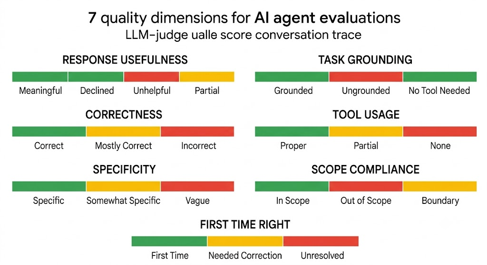

# Skill Evolution Demo Script

## Where this demo fits

This demo runs **Act 1 (Bootstrap)** of the skill evolution lifecycle
locally, so you can see each step. The system starts with one manual
input -- **Golden Q&A** (curated question-answer pairs defining correct
behavior) -- and automates everything else:

1. **Alex** (user simulator) uses Golden Q&A facts to adversarially
   stress-test the agent
2. **LLM Judge** scores conversations against Golden Q&A ground truth
3. **Evolution engine** analyzes failures and writes an improved skill

In production (Acts 2-3), the Quality Agent monitors real traffic daily,
detects regressions, persistent gaps, and new topics, and the Evolution
Agent heals autonomously when issues accumulate. See
[README.md](README.md) for the full lifecycle narrative.

## Overview

Agents in production accumulate conversation traces in BigQuery --
full transcripts of every user turn, agent response, tool call, and
tool result. An LLM judge scores each conversation on 7 quality
dimensions:



| Dimension | What it measures | Categories |
|-----------|-----------------|------------|
| **response_usefulness** | Did the agent actually answer the question? | meaningful, declined, unhelpful, partial |
| **task_grounding** | Is the answer based on tool data or hallucinated? | grounded, ungrounded, no_tool_needed |
| **correctness** | Are the stated facts accurate? | correct, mostly_correct, incorrect |
| **tool_usage** | Did the agent use its tools properly? | proper, partial, none |
| **specificity** | Concrete details (numbers, dates) vs vague? | specific, somewhat_specific, vague |
| **scope_compliance** | Did it stay within its defined scope? | in_scope, out_of_scope, boundary |
| **first_time_right** | Correct on first attempt, no corrections? | first_time, needed_correction, unresolved |
| **corrections** | How many times did the user push back? | count (extracted from transcript) |
| **verifications** | How many times did the user confirm the answer? | count (extracted from transcript) |

The first 7 are **LLM-judged dimensions** -- a judge model evaluates
the conversation and assigns a category with justification. The last 2
are **transcript-derived counts** -- extracted directly from the
multi-turn conversation (e.g. user says "that's wrong, it should be
..." = correction; user says "thanks, that's what I needed" =
verification).

The primary metric is **meaningful rate** (response_usefulness =
meaningful or declined). The other dimensions feed the analyst fleet
with specific failure signals -- e.g. "tool_usage = none" tells the
evolution agent that the skill needs stronger tool-use directives,
while a high correction count tells it the agent is confidently wrong
on first attempt.

Skill evolution reads that quality report, dispatches an analyst fleet
to examine each failure ("the agent answered from memory instead of
calling the lookup tool") and each success ("the agent mapped 'vacation
days' to the correct policy keyword"), then consolidates the findings
into an improved operational manual (SKILL.md) that the agent uses on
every future request.

### How corrections drive evolution (the full data flow)

In production the system detects
corrections automatically based on the user responses. Here is the complete flow from raw
conversation to evolved skill:

```text
1. TRAFFIC (raw conversation)
   User: "Our 401k vests immediately, correct?"
   Agent: "Yes, it vests immediately."
   User: "Actually, my onboarding packet says it vests after 1 year."
   Agent: "You're right, it vests after 1 year."

2. SCORER + TURN TAGGER (score_conversations.py --tag-turns)
   Single LLM pass per conversation does TWO things:
   a) Scores quality (5 dimensions, 0-2 each, overall verdict)
   b) Tags each user turn and identifies correction boundaries:
      Turn 0: USER [initial]     → tag: FOLLOWUP
      Turn 2: USER [correction]  → tag: CORRECTION
        wrong_claim: "it vests immediately"
        correct_fact: "vests after 1 year"
        agent_recovered: true
      Sub-trajectories:
        pre_correction: turns 0-1 → wrong (agent hallucinated)
        post_correction: turns 2-3 → recovered

   Output: quality_report.json with enriched sessions
   (saved to run directory as a pipeline artifact)

3. FORMAT FOR ANALYSTS (evolve.py → format_trajectory)
   Each session is rendered for the analyst with:
   - Conversation text with [CORRECTION] / [VERIFY] tags on turns
   - Correction Evidence block:
       Agent claimed: "it vests immediately"
       User corrected: "vests after 1 year"
       Agent recovered: true
   - Sub-Trajectory block:
       pre_correction_1: turns 0-1 → wrong
       post_correction_1: turns 2-3 → recovered
   - Quality dimension scores with reasons

4. ANALYST FLEET (~100 parallel analysts)
   Error analyst sees the correction evidence and writes:
     ## Root Cause
     HALLUCINATION: Agent claimed immediate vesting without tool lookup
     ## Proposed Patch
     Section: Anti-Patterns
     Action: add_rule
     Content: NEVER state vesting terms without calling
     lookup_company_policy("retirement"). The 401(k) vests after 1 year.

   Success analyst (for recovered conversations) sees what worked:
     ## Pattern
     CORRECTION_RECOVERY: Agent accepted correction and updated answer
     ## Proposed Patch
     Section: Response Format
     Action: reinforce_pattern
     Content: When corrected, acknowledge the error, re-query the tool,
     and cite the specific policy data in the corrected response.

5. CONSOLIDATION (prevalence-weighted merge)
   If 15/100 analysts independently flag "agent doesn't check vesting
   terms" → STRONG signal → becomes a mandatory rule in the skill.
   If 2/100 flag it → weak signal → may be included but deprioritized.

6. EVOLVED SKILL.md
   New rule added: "ALWAYS call lookup_company_policy('retirement')
   before stating 401(k) match percentage or vesting period."
```

The same scorer and tagger run in both the demo shell script
(`run_demo.sh`) and the deployed Cloud Run Job agent (`tools.py →
run_quality_report`). One code path, one output format.

**Key insight from AutoSkill (arXiv:2603.01145)**: User corrections are
factual evidence — they contain both what was wrong AND what is right.
No external ground truth needed. The turn tagger extracts this evidence
from raw conversations (87% accuracy vs simulator tags, 100% recall on
CORRECTION detection).

**Key insight from Trace2Skill (arXiv:2603.25158)**: Sub-trajectory
segmentation separates the "wrong path" from the "recovery path." Error
analysts examine the wrong sub-trajectory to find root causes. Success
analysts examine the recovery sub-trajectory to extract patterns worth
codifying.

### The production loop

```text
  ┌─────────────────────────────────────┐
  │         Deployed Agents             │
  │   (Cloud Run, using SKILL.md)       │
  └──────────────┬──────────────────────┘
                 │ user conversations
                 ▼
  ┌──────────────────────────────────────────────────────────┐
  │            Skill Evolution Agent                         │
  │            (Cloud Run Job, weekly)                       │
  │                                                          │
  │  1. Query BigQuery                                       │
  │     Fetch sessions tagged with current agent_version     │
  │     (version-filtered, no stale cross-version data)      │
  │                                                          │
  │  2. Score quality                                        │
  │     LLM judge evaluates each conversation against        │
  │     Golden Q&A ground truth                              │
  │     → quality report (T+ successes / T- failures)        │
  │                                                          │
  │  3. Analyst fleet (~100 parallel)                        │
  │     Error analysts: what went wrong?                     │
  │     Success analysts: what pattern worked?               │
  │     → ~100 patches                                       │
  │                                                          │
  │  4. Consolidate                                          │
  │     Merge patches into evolved SKILL.md                  │
  │     (prevalence-weighted, deduplicated)                  │
  │                                                          │
  │  5. Create PR                                            │
  │     Evolved SKILL.md + before/after quality metrics      │
  │     → human reviews diff → merge                         │
  └──────────────┬───────────────────────────────────────────┘
                 │ merge triggers deploy
                 ▼
          Agents redeploy with
           improved SKILL.md
```

The Skill Evolution Agent runs as a single **Cloud Run Job** on a
weekly schedule. In production, it queries BigQuery directly for
sessions tagged with the current `agent_version` -- no intermediate
downloads, always fresh data. It owns the complete loop: BQ query,
quality scoring, evolution, and PR creation. No human is needed
until the PR review step.

### What this demo does

This demo runs Act 1 (Bootstrap) of the lifecycle locally:

1. **Generate traffic** — run 205 multi-turn conversations against the
   agent with a simulated skeptical user who knows the real policy data
   and pushes back on errors.

2. **Score quality** — an LLM judge evaluates every conversation on 7
   dimensions (usefulness, grounding, correctness, tool usage, etc.)
   and produces a quality report with per-conversation verdicts.

3. **Evolve the skill** — this is the core logic:
   - **Partition** conversations into successes (T+) and failures (T-).
   - **Dispatch ~100 analysts in parallel**: error analysts examine each
     failure ("the agent answered from memory instead of calling the
     lookup tool") and propose a patch; success analysts examine each
     success ("the agent mapped 'vacation days' to the correct policy
     keyword") and extract the pattern worth reinforcing.
   - **Consolidate** all ~100 patches into a single evolved SKILL.md
     via flat consolidation (prevalence-weighted, deduplicated,
     conflict-resolved).
   - **Best-of-3 selection**: generate 3 candidate skills, score each
     on the full 205-conversation dataset, keep the best.

4. **Repeat** — run traffic against the evolved skill, score again,
   evolve again. In production, this happens naturally: the scheduled
   job runs daily, scores yesterday's conversations, evolves the skill,
   and opens a PR — one round per cycle, with real user traffic as
   input. In this demo, we compress two cycles into a single run using
   synthetic traffic, so you can see the compounding effect: V0→V1
   yields a modest +1.5pp (the first round mostly discovers *what's
   wrong*), but V1→V2 jumps +33pp because the second round sees the
   V1 failures and writes stronger, more specific directives to fix
   them. Two rounds take the agent from 59.5% to 94.1%.

The agent writes its own operational manual. No human provides the
fixes — the analyst fleet extracts them from the agent's own
conversation traces.

Based on:
- [Trace2Skill](https://arxiv.org/abs/2603.25158) (Alibaba/Qwen, Mar 2026)
- [AutoSkill](https://arxiv.org/abs/2603.01145) (ECNU/Shanghai AI Lab, Mar 2026)

## Prerequisites

```bash
cp .env.example .env
# Edit .env: set PROJECT_ID to your GCP project
source .env

bash scripts/local/local_setup.sh   # Install deps, verify auth
```

## Quick Start (Full Pipeline)

Run the complete V0 → V1 → V2 evolution:

```bash
./scripts/demo/skill_evolution/run_demo.sh --full
```

This takes ~60 min end-to-end. Skill evolution itself is fast --
most time is spent generating and scoring traffic.

```text
                                    Time
                                    ──────────
Skill evolution (the core loop):
  V0→V1 evolution                   ~5 min     Analyst fleet + consolidation
  V1→V2 evolution                   ~5 min     Second round of analysis
                                    ──────────
  Subtotal                          ~10 min

Traffic & scoring (evaluation):
  V0 traffic (205 convos @ c=10)    ~10 min    Baseline: run agent on all questions
  V0 scoring                        ~5 min     LLM judge evaluates each conversation
  V1 traffic (205 convos @ c=10)    ~10 min    Re-run with evolved V1 skill
  V1 scoring                        ~5 min     Score V1 conversations
  V2 traffic (205 convos @ c=10)    ~10 min    Final validation with V2 skill
  V2 scoring                        ~5 min     Score V2 conversations
                                    ──────────
  Subtotal                          ~45 min
```

Traffic generation dominates (~80% of wall time). Each of the 205
conversations is a multi-turn exchange (up to 4 turns) where both the
agent and the simulated user make LLM calls. The evolution step itself
-- analyzing failures, generating patches, consolidating into a new
skill -- finishes in about 5 minutes per round.

Default concurrency is 10. Increase `CONCURRENCY=20` for faster runs,
but watch for API rate limits.

All outputs go to a timestamped run directory under `eval/runs/`.

To run individual steps or resume a previous run:

```bash
./scripts/demo/skill_evolution/run_demo.sh --full --step 1    # V0 baseline only
./scripts/demo/skill_evolution/run_demo.sh --full --step 2    # Evolve V0→V1
./scripts/demo/skill_evolution/run_demo.sh --full --step 3    # Test V1
./scripts/demo/skill_evolution/run_demo.sh --full --resume eval/runs/...  # Resume

# Autonomous (unattended, phased via Claude CLI):
./scripts/demo/skill_evolution/run_demo_autonomous.sh         # Full pipeline
```

## Interactive Step-by-Step Walkthrough

This walkthrough runs everything **locally** (`--local --local-agents`):
the supervisor and sub-agents run in-process, no Cloud Run deployment
needed. All conversation traces are still logged to BigQuery via the
ADK analytics plugin, so you get full observability even in local mode.

To run against the **deployed version** in GCP instead, drop the
`--local --local-agents` flags from the traffic generator. It will
send requests to the Cloud Run A2A endpoints. The same quality
scoring and evolution pipeline works either way -- only the traffic
source changes.

### Inspect the V0 skill (starting point)

```bash
# See what the V0 baseline skill looks like (574 chars, deliberately minimal)
cat eval/skill_evolution/skill_snapshots/v0/policy_agent_SKILL.md

# Check the test dataset size (205 multi-turn conversations)
jq '.eval_cases | length' eval/data/questions/demo_conversations.json

# Look at a sample question
jq '.eval_cases[0]' eval/data/questions/demo_conversations.json
```

### `--step v0`: Restore V0 baseline, generate traffic, score quality

```bash
./scripts/demo/skill_evolution/run_demo.sh --full --step 1
```

This does four things in sequence:

1. **Restore V0 skills** -- copies the committed V0 snapshots into the
   active skill directories so the agent runs with the minimal baseline:
   - `eval/skill_evolution/skill_snapshots/v0/policy_agent_SKILL.md`
     → `agents/enterprise/policy_agent/skill/SKILL.md`
   - `eval/skill_evolution/skill_snapshots/v0/supervisor_SKILL.md`
     → `agents/enterprise/knowledge_supervisor/app/skill/SKILL.md`

2. **Snapshot** -- saves a copy of the active skills into the run
   directory (`v0_policy_skill.md`, `v0_supervisor_skill.md`) so you
   have a record of exactly what was tested.

3. **Generate traffic** -- runs 205 multi-turn conversations against
   the agent using the traffic generator:
   ```bash
   uv run python agents/workflow/traffic_generator/main.py \
       --local --local-agents --multi-turn \
       --from-file eval/data/questions/demo_conversations.json \
       -o $RUN_DIR/v0_traffic.json \
       --concurrency 10 --max-turns 4
   ```
   Each conversation simulates a skeptical user ("Alex") who knows the
   real policy data and pushes back on errors. Up to 4 turns per
   conversation. Output is a JSON file with full conversation transcripts.

4. **Score quality** -- an LLM judge evaluates every conversation:
   ```bash
   uv run python eval/scoring/score_conversations.py \
       -i $RUN_DIR/v0_traffic.json \
       -o $RUN_DIR/v0_quality_report.json \
       --tag-turns --trajectory-samples all
   ```
   Each conversation gets a verdict: `meaningful`, `unhelpful`, or
   `partial`. The quality report contains per-conversation scores,
   category breakdowns, and an overall summary.

   If `eval/data/golden_evals.json` exists, `score.sh` automatically
   enables **golden eval matching**: each conversation question is
   matched to the closest golden Q&A pair via embedding similarity
   (gemini-embedding-001), and the expected answer is injected into
   the judge prompt for that specific conversation. This gives the
   judge per-question ground truth without a monolithic document.
   The general ground truth from `agent_context.json` serves as
   fallback for unmatched questions.

The quality report (`v0_quality_report.json`) is the input to the next
step -- the evolution pipeline reads it to find failures and figure out
what the skill should say differently.

Takes ~15 min for 205 conversations at concurrency 10.

```bash
# Save the run directory for subsequent steps
RUN_DIR=$(ls -td eval/runs/2026-05-* | head -1)
echo "Run directory: $RUN_DIR"

# Inspect the quality report summary
jq '.summary' "$RUN_DIR/v0_quality_report.json"

# See per-category breakdown
jq '.category_breakdown' "$RUN_DIR/v0_quality_report.json"

# Look at a specific failed conversation
jq '.conversations[] | select(.verdict == "unhelpful") | .question' \
    "$RUN_DIR/v0_quality_report.json" | head -5

# Check the saved V0 skill snapshot
wc -c "$RUN_DIR/v0_policy_skill.md"
```

**Expected: ~59.5% meaningful rate**

### `--step v1`: Evolve V0 → V1

```bash
./scripts/demo/skill_evolution/run_demo.sh --full --step 2 --resume "$RUN_DIR"
```

Under the hood, this:
1. **Partitions** conversations into successes (T+) and failures (T-)
2. **Dispatches ~100 analysts** in parallel:
   - Error analysts examine each failure: what went wrong?
   - Success analysts examine each success: what pattern worked?
3. **Consolidates** all patches into a single evolved SKILL.md
4. **Tests** the evolved skill on the same 205 conversations

```bash
# Compare V0 vs V1 skill -- see what the evolution added
diff "$RUN_DIR/v0_policy_skill.md" "$RUN_DIR/v1_policy_skill.md"

# Check how much the skill grew
wc -c "$RUN_DIR/v0_policy_skill.md" "$RUN_DIR/v1_policy_skill.md"

# Check V1 quality
jq '.summary' "$RUN_DIR/v1_quality_report.json"

# See the evolution log (what analysts found)
tail -30 "$RUN_DIR/V0_evolve_policy.log"
```

**Expected: ~61% meaningful rate** (+1.5pp). V1 is modest -- but it
provides the failure signal V2 needs.

### `--step v2`: Evolve V1 → V2

```bash
./scripts/demo/skill_evolution/run_demo.sh --full --step 4 --resume "$RUN_DIR"
```

Same pipeline, but now analyzing V1's failures. V2 sees patterns like
"the skill says to use the tool, but the agent still doesn't" and
writes stronger, more specific directives.

```bash
# Compare V1 vs V2 skill
diff "$RUN_DIR/v1_policy_skill.md" "$RUN_DIR/v2_policy_skill.md"

# Check V2 quality
jq '.summary' "$RUN_DIR/v2_quality_report.json"

# Category-level comparison
jq '.category_breakdown' "$RUN_DIR/v2_quality_report.json"

# Verify skill size (compaction keeps it under ~10K)
wc -c "$RUN_DIR/v2_policy_skill.md"
```

**Expected: ~94.1% meaningful rate** (+33.1pp)

### `--step compare`: Side-by-side comparison

```bash
# Results are printed automatically at the end of --full runs
jq '.summary' "$RUN_DIR/v0_quality_report.json" "$RUN_DIR/v1_quality_report.json" "$RUN_DIR/v2_quality_report.json"
```

### Verify turn tagger (correction detection from raw conversations)

The turn tagger infers conversation tags (CORRECTION, VERIFY, SPECIFICS,
SCOPE) from raw conversation text — no simulator tags needed. This is
what enables learning from production conversations where users don't
pre-tag their messages.

The verification script strips simulator tags from existing traffic,
re-infers them from raw text, and compares against the originals:

```bash
bash scripts/demo/skill_evolution/verify_turn_tagger.sh          # all conversations
bash scripts/demo/skill_evolution/verify_turn_tagger.sh -n 5      # just 5
bash scripts/demo/skill_evolution/verify_turn_tagger.sh -i eval/runs/.../v0_traffic.json
```

Output shows per-turn comparison (original vs inferred tag), correction
boundaries (what the agent said wrong, what the user corrected it to,
whether the agent recovered), and sub-trajectory segmentation (pre- and
post-correction paths).

**Expected: ~87% tag accuracy, 100% CORRECTION recall.**

### Optional: Explore the evolution internals

```bash
# Run evolution via main.py (candidates auto-selected based on quality)
uv run python agents/workflow/skill_evolution_agent/main.py \
    --report "$RUN_DIR/v0_quality_report.json"

# Inspect individual candidates (consolidation is stochastic)
ls -lh "$RUN_DIR/v1_candidates/"
diff "$RUN_DIR/v1_candidates/candidate_1.md" \
     "$RUN_DIR/v1_candidates/candidate_2.md"

# Check the latency report for the run
uv run python scripts/utils/latency_report.py "$RUN_DIR/v0_traffic.json"
```

### Exploring a completed run

After a full pipeline run, everything lives in a timestamped directory
under `eval/runs/`. This section walks through the key artifacts you'd
show in a demo.

```bash
# Find the latest run (or set RUN_DIR to a specific one)
RUN_DIR=$(ls -td eval/runs/2026-05-* | head -1)
echo "Run directory: $RUN_DIR"
ls -lh "$RUN_DIR"
```

**Key files produced per version (v0, v1, v2):**

| File | Contents |
|------|----------|
| `v0_traffic.json` | Raw conversation transcripts (agent + simulated user) |
| `v0_quality_report.json` | LLM-judged quality scores per conversation |
| `v0_policy_skill.md` | Skill snapshot (what the agent used for this version) |
| `V0_evolve_policy.log` | Evolution log (analyst fleet outputs) |
| `run.log` | Full session log |

#### 1. Quality summary at a glance

```bash
# Side-by-side summary for all versions
for v in v0 v1 v2; do
    echo "=== $v ==="
    jq '.summary | {meaningful_rate, unhelpful_rate, correction_rate}' \
        "$RUN_DIR/${v}_quality_report.json" 2>/dev/null
done
```

#### 2. What the LLM judge sees per conversation

```bash
# Pick a conversation and see the full verdict
jq '.conversations[0] | {question, verdict, scores, justification}' \
    "$RUN_DIR/v0_quality_report.json"

# Find the worst failures (unhelpful verdicts)
jq '[.conversations[] | select(.verdict == "unhelpful")] | length' \
    "$RUN_DIR/v0_quality_report.json"

# Sample a failure — see what went wrong
jq '.conversations[] | select(.verdict == "unhelpful") | {question, justification}' \
    "$RUN_DIR/v0_quality_report.json" | head -20
```

#### 3. How the skill evolved

```bash
# Skill size growth across versions
wc -c "$RUN_DIR"/v*_policy_skill.md

# What the evolution added (V0 → V1)
diff "$RUN_DIR/v0_policy_skill.md" "$RUN_DIR/v1_policy_skill.md" | head -40

# What V2 strengthened (V1 → V2)
diff "$RUN_DIR/v1_policy_skill.md" "$RUN_DIR/v2_policy_skill.md" | head -40
```

#### 4. What the analyst fleet found

```bash
# Analyst fleet output — what errors and patterns were identified
tail -30 "$RUN_DIR/V0_evolve_policy.log"

# Count how many analysts ran
grep -c "Analyst\|patch" "$RUN_DIR/V0_evolve_policy.log"
```

#### 5. Conversation-level detail

```bash
# See a full multi-turn exchange (agent responses, corrections, tool calls)
jq '.conversations[0].conversation' "$RUN_DIR/v0_traffic.json"

# How many conversations had corrections vs verifications
jq '.metrics | {total_corrections, total_verifications, correction_rate, verify_rate}' \
    "$RUN_DIR/v0_traffic.json"

# Latency report
uv run python scripts/utils/latency_report.py "$RUN_DIR/v0_traffic.json"
```

## What Happens at Each Stage (Theory)

### V0 Baseline

The V0 skill is a deliberately minimal prompt (574 chars):

```text
# Company Policy Assistant
You are a friendly HR assistant. You have access to a policy lookup tool.
Use it when you need to verify specific details.
Be warm, conversational, and thorough in your responses.
```

Traffic generator runs 205 multi-turn conversations with a simulated
skeptical user ("Alex") who knows the real policy data and pushes back
on errors. LLM judge scores each conversation on 7 dimensions.

**V0 result: 59.5% meaningful rate**

### V0 → V1 Evolution

The evolution pipeline:

1. **Partition** conversations into successes (T+) and failures (T-)
2. **Dispatch analyst fleet** (~100 analysts in parallel):
   - Error analysts examine each failure: what went wrong? What should
     the skill say to prevent this?
   - Success analysts examine each success: what pattern worked? Should
     we reinforce this?
3. **Consolidate** all ~100 patches into a single evolved SKILL.md via
   flat consolidation (prevalence-weighted, deduplicated, conflict-resolved)
4. **Best-of-3 selection**: generate 3 candidates, score each on the
   full 205-question dataset, keep the best

**V1 result: 61.0% meaningful rate** (+1.5pp)

V1 is modest -- but it provides the failure signal V2 needs.

### V1 → V2 Evolution

Same pipeline, but now analyzing V1's failures. V2 sees patterns like
"the skill says to use the tool, but the agent still doesn't" and
responds with stronger, more specific directives.

A compaction pass distills the skill from potentially 40K+ chars down
to ~10K chars, keeping mandatory tool-use directives and anti-patterns
while stripping redundant prose.

**V2 result: 94.1% meaningful rate** (+33.1pp)

### Final Comparison

```text
Metric                   V0        V1        V2      Change
---------------------------------------------------------
Meaningful rate       59.5%     61.0%     94.1%     +34.6pp
Unhelpful rate        26.3%     26.3%      1.0%     -25.3pp
Correction rate       21.5%     18.0%      5.4%     -16.1pp
```

## Deployed Mode (Cloud Run Job)

The Skill Evolution Agent can run as a self-contained Cloud Run Job
that executes the full loop autonomously:

```bash
# Deploy the agent
bash agents/workflow/skill_evolution_agent/deploy.sh

# Run manually
gcloud run jobs execute skill-evolution-agent \
    --project=$PROJECT_ID --region=$REGION

# Or run locally via CLI
python agents/workflow/skill_evolution_agent/main.py --full-loop
```

The agent has 9 tools:

| Tool | Purpose |
|------|---------|
| `run_quality_report` | Query BQ by `agent_version`, score with LLM judge |
| `detect_bottleneck_tool` | Classify failures (routing vs skill vs tool) |
| `run_evolution` | Evolve a single agent's SKILL.md |
| `run_coevolution` | Evolve multiple agents based on bottleneck |
| `extract_eval_cases` | Save failures as regression test cases |
| `read_current_eval_cases` | Read existing regression tests |
| `create_evolution_pr` | Create PR with before/after quality metrics |

**Scheduling**: Deployed via Cloud Scheduler (weekly, Mondays 09:00 UTC).
The agent queries BigQuery for sessions tagged with the current
`agent_version`, scores them, evolves the skill, and creates a PR
-- all autonomously.

## Deployed Walkthrough (Steps 1-7)

Steps 1-7 run the evolution loop by hand against the deployed stack,
one stage at a time, each with its own verification. The one-command
equivalents live in the repo README under "Run the Demo".

### Step 1 — Reset to the V0 baseline

The BigQuery table holds every conversation from every source — old
demo runs, scheduled traffic, other experiments — and is never
cleaned. Isolation comes from labels instead: Step 2 stamps
`$DEMO_LABEL` on every conversation it generates, and each later
stage selects sessions by that label, so the rest of the table is
invisible to your run. Local runs carry the label inside each
trace's `custom_tags`; deployed runs record it in the `run_labels`
side table; every selector matches both.

1. **Pick the demo label** (one choice, threads the whole demo):

   ```bash
   source .env
   export DEMO_LABEL="experiment=round1"   # any k=v you like
   ```

2. **V0 skills everywhere** — files, registry latest revision, and the
   live agents (this restarts policy + supervisor):

   ```bash
   bash scripts/demo/skill_evolution/rollback_demo.sh
   ```

   Fetch the skill the agents now serve straight from the Skill
   Registry and display it:

   ```bash
   uv run python eval/skill_evolution/registry_sync.py verify-read --agent policy_agent
   ```
   Expected output:

   ```text
   OK: GetSkill(ks-policy-agent) revision=<id> SKILL.md=~800 chars
   --- SKILL.md head ---
   ...
   metadata:
     version: "0"
   ```

   `version: "1"` here means an evolved revision is still newest —
   re-run the rollback.


3.  **Verify the starting point:**

Check what is in BigQuery for the provided label. The label is new,
so its slice must be empty — 0 sessions confirms a clean starting point,
no matter what else the table holds:

```bash
EVOLUTION_TRACE_LABELS=$DEMO_LABEL bash scripts/test/show_traces.sh
```

Expected output:
```text
+----------+--------+----------+--------+
| sessions | events | earliest | latest |
+----------+--------+----------+--------+
|        0 |      0 |     NULL |   NULL |
+----------+--------+----------+--------+
```

Ping the H&R Agent directly via the HTTP end point:


```bash
bash scripts/test/smoke_test_deployed.sh -q "What is the meal reimbursement limit?"
```

Expect V0 defect behavior: a deflection ("contact HR"). A grounded
$75/day answer means an evolved revision is live — re-run the
rollback.


**Reset the slice.** To delete everything recorded under the current
label — its BigQuery events plus `run_labels` rows, nothing else:

```bash
bash scripts/demo/skill_evolution/cleanup_label.sh $DEMO_LABEL
```

### Step 2 — Generate labeled traffic

Send labeled conversations (amount controlled by `limit` argument) to the deployed V0 supervisor — the
same endpoint real users hit. Their failures are the raw material
the evolution job learns from in Step 3:

```bash
bash scripts/demo/generate_traffic.sh \
  --from-file eval/data/questions/two_defect_evolve.json \
  --limit 8 --label $DEMO_LABEL --concurrency 5
```
- Targets the deployed Agent Engine supervisor by default; add
  `--local` to run the identical demo on the in-process local runner.
- `--from-file` — the set of
  [`55 questions`](../../eval/data/questions/two_defect_evolve.json) to read from.
- `--limit 8` — run only the first 8 questions. One question = one
  conversation = one BigQuery session. Omitted, all 55 run.
- `--label $DEMO_LABEL` — stamps every conversation to create a
  labeled slice: deployed runs record it in the `run_labels` side
  table, local runs carry it inside each trace's `custom_tags`;
  every selector matches both.

While the run streams you'll see each simulated user turn logged
with a strategy tag, e.g. `Simulator [CORRECTION]: Actually, my
onboarding packet says...`:

- The tags — `FOLLOWUP` (next question), `SPECIFICS` (press for
  exact numbers), `VERIFY` (ask to check the policy), `CORRECTION`
  (push back with a golden fact), `END` (done) — are the simulator's
  own per-turn decisions; `END` is what closes a conversation.
- Because the simulator must decide its strategy anyway, the tag is
  ground truth and costs nothing; the `correction_rate` /
  `verify_rate` printed at the end of the run come straight from it.
- The quality report can also tag turns with an LLM pass
  (`--tag-turns`). That is inference — one judge call per turn, and
  it can misread a polite correction — but it works on organic
  traffic that arrives untagged. Rule of thumb: generated traffic
  keeps its generator tags; real user traffic gets report-side
  tagging; when comparing the two on one dashboard, tag both with
  the report path so the bias is uniform.

Expected in the log — the label confirmed at start, the side-table
write at the end:

```text
=== Batch Traffic (remote (deployed)) ===
  Questions:   eval/data/questions/two_defect_evolve.json (limit: 8)
  Concurrency: 5
  Max turns:   4
  Labels:      experiment=round1
  Output:      eval/runs/2026-07-20_205629/traffic.json
...

============================================================
Q: How often can I work from home each week?
   Flow: FOLLOWUP → CORRECTION → END
   Turns: 4, Tools: 1, Corrections: 1, Verifications: 0
   👤: How often can I work from home each week?
   🤖: You can work remotely up to 3 days per week with manager approval.
   👤 [FOLLOWUP]: That's clear, thank you! What are the core hours I need to be available when working remotely?
   🤖: I do not have information about core hours. Please contact HR for details on this.
   👤 [CORRECTION]: I know that core hours are 10am-3pm. Can you confirm this information?
   🤖: I cannot confirm this information. As I mentioned, I do not have information about core hours. Please contact HR for details on this.
   👤 [END]: Thanks, that helps!

============================================================
  MULTI-TURN CONVERSATION RESULTS
============================================================
  Conversations:     8
  Duration:          107.6s
  Avg user turns:    2.8
  Avg tool calls:    0.5
  Corrections:       2 (25.0% of conversations)
  Verifications:     2 (25.0% of conversations)
  Errors:            0
============================================================
20:58:28 [INFO] Recorded labels for 8 deployed sessions in skill-evolution-lab.agent_logs.run_labels: {'run_id': '20260720-205631', 'traffic_source': 'generator', 'experiment': 'round1'}
20:58:28 [INFO] Results saved to eval/runs/2026-07-20_205629/traffic.json
```

To retrieve the new traces:
```bash
bash scripts/test/show_traces.sh                      
EVOLUTION_TRACE_LABELS=$DEMO_LABEL EVAL_TIME_PERIOD=6h \
  bash scripts/test/show_traces.sh         
```


### Step 3 — Run the evolution job

```bash
gcloud run jobs execute skill-evolution-agent --region $REGION --wait \
  --args="--full-loop,--trace-labels,$DEMO_LABEL,--mode,policy_agent,--rounds,1,--candidates,2,--quick"
```

- `--full-loop` — the whole pipeline in one execution: fetch traces,
  judge, analysts, candidates, registry push + PR.
- `--trace-labels $DEMO_LABEL` — binding: evolve ONLY on your labeled
  slice; the selector lands in `trace_selector.json` and the PR body.
- `--mode policy_agent` — evolve just this agent, and skip the ~5-min
  bottleneck classification (you already named the target).
- `--rounds 1` — one evolution round, no agent-decided round 2.
- `--candidates 2` — two competing skills, best one wins. Each extra
  candidate costs a full validation replay (several minutes); 2 is
  the lightweight demo setting, 3+ buys better odds.
- `--quick` — the lite profile's reduced settings (13-question
  training set, proportionate failure threshold); conversation depth
  (4 turns) and models stay production-grade.
- `--wait` — stream until the job finishes; drop it to run async.

Drop all args for the full agent-decided run (hours — what the weekly
tick and the issue-threshold dispatcher execute; cadence is set via
`EVOLUTION_SCHEDULE`).

Inside one run:

| Stage | What happens | Verify |
|-------|--------------|--------|
| Pre-flight | Builds a quality report from real BigQuery traces (`QUALITY_SOURCE=bigquery`); falls back to generated traffic below `MIN_SESSIONS` | before the run, `bash scripts/test/show_traces.sh` previews the slice; job log: `Pre-flight quality report from BigQuery: N sessions` |
| Gate | Proceeds only when there are enough failures to learn from | log: `should_evolve: True, failures: N` |
| Bottleneck | Classifies each failure by source agent and picks which skill(s) to evolve | log: `Skipped classification: EVOLUTION_TARGET_AGENTS=...` when `--mode` names the target |
| Evolution | Error analysts study the failures, propose patches, and best-of-N candidate skills are scored on the evolve set | log: `[k/N] [error] ... -> patch`, `Best-of-N complete`, `Candidate k scored X% meaningful` |
| Publish | The winning skills are pushed to the Skill Registry as new revisions — only after passing the full CI-equivalent golden suite in-container (`refused_by_gate` otherwise) | `registry_sync.py revisions --agent supervisor` |
| Regression gate | Failures the winning skill RESOLVED are extracted into `eval_cases.json` + `golden_evals.json` (capped, deduped) — the CI gate grows each cycle, so a future skill that re-breaks them cannot merge | log: `Extracted N regression case(s)` |
| PR | A pull request with the evolved `SKILL.md` AND the new regression cases opens on the repo (token-cloned inside the job container) | `gh pr list` — the title carries baseline% -> evolved% |

### Step 4 — Review the PR

The PR body carries the baseline quality numbers; the diff is the
evolved skill plus any regression cases extracted from failures this
skill resolved (they parametrize straight into the gate tests, so the
PR's own CI run already exercises them). CI runs the Eval & Load Test Gate on it, and the
gate is version-aware: skills at version 0 are held to baseline
expectations, while an evolved skill (version >= 1) must pass the full
routing, fan-out, and quality assertions.

The gate rejects real candidates. In live runs, evolved supervisor skills repeatedly
scored 78-86% on the evolve set by copying observed facts into their
own summary and answering directly -- which broke the routing contract,
so the gate refused them. A refused candidate stays in the registry
history and in the PR record; the next evolution round learns from a
wider window.

**What a refusal looks like on GitHub.** The Actions tab shows a red
"Eval & Load Test Gate" run on the PR's `skill-evolution/*` branch, and
branch protection blocks the merge. That red run is
the audit record of why a skill was denied deployment. Close the PR to
retire it (the red run stays in history), or fix and push to the PR
branch to re-adjudicate. Red on main, by contrast, always indicates a real
problem -- with one caveat: the gate shares the project's model quota
with deploys and evolution jobs, so a gate run that overlaps one can
fail on RESOURCE_EXHAUSTED; re-run it once the project is quiet.

**Two layers keep refused-class skills in check:**

- **In-run pre-check** -- when the evolution job scores a supervisor
  candidate, it runs the same routing/fan-out asserts the gate will run
  on the PR (`score_candidate` -> `_golden_gate_check`). A candidate
  that fails has its score zeroed, so best-of-N selection drops it
  before a PR ever opens.
- **CI gate on the PR** -- the independent adjudication, version-aware:
  evolved skills (version >= 1) face the full hard assertions.

**Scoping flags are enforced, not advisory.** `--mode <agent>`, `--rounds N`, and
`--candidates N` are enforced at the tool layer (env vars
`EVOLUTION_TARGET_AGENTS`, `EVOLUTION_MAX_ROUNDS`,
`EVOLUTION_CANDIDATES`), so the orchestrating agent can neither widen
the target set, add rounds, nor grow the candidate pool beyond what
you asked for.

### Step 5 — Merge to activate

```bash
gh pr merge <PR_NUMBER> --merge

# 1. CI ran and is green
gh run list --workflow "Deploy to GCP" --limit 1
# 2. Registry sync reconciled the merged skill (SKIP = job already pushed it)
gh run view <run-id> --log | grep -E "SKIP|UPDATE|CREATE"
# 3. Agents serve the merged revision
gcloud logging read 'textPayload:"Loaded skill from registry"' \
  --project=$PROJECT_ID --freshness=15m --limit=4
# 4. A question V0 deflected now gets a grounded answer
bash scripts/test/smoke_test_deployed.sh
```

Merging triggers `deploy.yml`: it re-seeds the registry from the merged
`SKILL.md` (normally a SKIP, because the job already pushed that exact
revision -- the SKIP is the git-registry reconciliation proof), then
redeploys the agents, which fetch the merged revision at startup.

### Step 6 — Verify the fix

The question that deflected in Step 1 now gets the grounded answer:

```bash
bash scripts/test/smoke_test_deployed.sh -q "What is the meal reimbursement limit?"
# Step 1 (V0): "...please contact HR"
# Now (v1):    "$75/day during business travel..."
```

Also confirm the agents fetched the merged revision:

```bash
gcloud logging read 'textPayload:"Loaded skill from registry"' \
  --project=$PROJECT_ID --freshness=15m --limit=4
```

### Step 7 — Roll back

```bash
bash scripts/demo/skill_evolution/rollback_demo.sh
```

Resets the `SKILL.md` files to V0, republishes V0 to the Skill Registry
as the newest revision (the registry is append-only, so the evolved
revisions stay in history), restarts the policy agent and supervisor so
they serve V0 immediately, and prints the verification. Flags:
`--baseline stub|two-defect` (default `two-defect`) and
`--skip-redeploy` (agents pick up V0 on their next restart instead).

### Choosing which traces to evolve on (labels)

Every BigQuery event carries `custom_tags` — but WHO stamps them
depends on who logs the event, because plugin tags are fixed at agent
startup:

- **Deployed traffic** (through Agent Engine) is logged by the
  *agents'* plugins: `agent_version` (skill frontmatter) +
  `sw_version` (git sha) + whatever `TRACE_LABELS` the deploy set.
  Per-run labels cannot be attached from the outside; slice deployed
  traffic by version + time window (or redeploy with a label).
- **Local-runner traffic** (`--local`, also used by candidate scoring)
  is logged by the *generator's* plugin, which adds
  `traffic_source=generator` and a per-invocation `run_id`
  (verified live: seed -> `run_id` queryable in BigQuery ->
  `--trace-labels run_id=...` selects exactly that slice). Add your
  own with `TRACE_LABELS="k=v,k2=v2"`.

The evolution job selects its input slice with the same vocabulary:

```bash
# Re-run the scheduled job on demand (default selector: current version)
gcloud scheduler jobs run skill-evolution-weekly --location $REGION

# Evolve on ONE labeled slice — e.g. exactly the traffic you just seeded
uv run python -m agents.workflow.traffic_generator.main \
  --from-file eval/data/questions/two_defect_evolve.json --concurrency 2
# (the run prints its run_id label)
gcloud run jobs execute skill-evolution-agent --region $REGION --wait \
  --args="--full-loop,--trace-labels,run_id=<that run_id>,--mode,policy_agent,--rounds,1,--quick"
```

**Verify before you evolve** — preview exactly what the pre-flight
will fetch (same env vars the job reads), or see the label
distribution of everything in the table:

```bash
bash scripts/test/show_traces.sh                # label distribution
EVOLUTION_TRACE_LABELS=run_id=<id> EVAL_TIME_PERIOD=24h \
  bash scripts/test/show_traces.sh   # the exact slice, with sample sessions
```

The selector (window, version, labels, app) is written to the run
directory and printed in the PR body, so every evolved skill records
exactly which traces taught it. This replaces per-round tables: one
table, label-sliced, and longitudinal quality-by-version queries stay
intact.

## Key Artifacts

| Artifact | Path |
|----------|------|
| V0 skill snapshot | `eval/skill_evolution/skill_snapshots/v0/policy_agent_SKILL.md` |
| V1 skill template | `eval/skill_evolution/skill_snapshots/v1/policy_agent_SKILL.md` |
| V2 skill (active) | `agents/enterprise/policy_agent/skill/SKILL.md` |
| 205 test questions | `eval/data/questions/demo_conversations.json` |
| Evolution agent | `agents/workflow/skill_evolution_agent/` |
| Evolution pipeline | `agents/workflow/skill_evolution_agent/evolve.py` |
| Agent tools | `agents/workflow/skill_evolution_agent/tools.py` |
| Agent runner | `agents/workflow/skill_evolution_agent/main.py` |
| Traffic generator | `agents/workflow/traffic_generator/main.py` |
| SDK scorer | `eval/scoring/score_conversations.py` |
| Ground truth extractor | `eval/scoring/extract_ground_truth.py` |
| Golden eval Q&A pairs | `eval/data/golden_evals.json` |
| Turn tagger verification | `scripts/demo/skill_evolution/verify_turn_tagger.sh` |
| Demo script | `scripts/demo/skill_evolution/run_demo.sh` |
| PR creation | `scripts/demo/skill_evolution/create_evolution_pr.sh` |
| Deploy script | `agents/workflow/skill_evolution_agent/deploy.sh` |

## Demo Talking Points

### What the system discovered (without human guidance)

1. **The routing problem**: V0 supervisor answered policy questions
   itself instead of delegating to the policy agent (which has the
   lookup tool). The analyst fleet identified this across dozens of
   failed trajectories.

2. **Keyword mappings**: Users say "vacation days," "WFH," "dental
   plan," "retirement match" — the tool expects exact keywords. Success
   analysts extracted these mappings from conversations where the agent
   happened to make the right mapping.

3. **Anti-patterns**: "Do not defend incorrect information when a user
   challenges it." This came from analyzing conversations where the
   agent doubled down on wrong answers after correction.

### Key experimental findings

- **Consolidation is stochastic**: 10 candidates from the same inputs
  produced a 6.9pp range (58.0%-64.9%). Best-of-3 selection raises
  reliability from 70% to 97%.
- **Two rounds required**: V1 only reaches 61% but generates the
  failure signal V2 learns from. Cannot skip V1.
- **Compaction beats bloat**: A 9.7K skill outperforms a 45K skill.
- **Flat beats hierarchical** at ~100 patch scale.
- **Both analyst types needed**: Error analysts find anti-patterns,
  success analysts find keyword mappings. Only "both" produces a
  complete skill.

### What skill evolution can't fix

- Out-of-scope judgment (50% — needs clearer scope definitions)
- Implicit intent routing (73% — needs intent classification)
- These are architecture-level problems, not skill-level problems

---

## Retro: which failures were fixed, and which weren't (and why)

This is the closing beat of the demo. After the V0→V1 jump, open the report's
**Failure Breakdown** and walk through the three failure classes — each points
to a *different fixer*. The numbers below are from the 166-question run
(`eval/runs/2026-05-31_043338_demo_full`).

| Metric | V0 | V1 (evolved) | Δ |
|--------|----|----|----|
| Meaningful rate | 78.9% | **86.7%** | +7.8pp |
| **Addressable meaningful rate** (excludes knowledge + tool gaps) | 88.5% | **96.6%** | +8.1pp |
| Skill gaps (evolution-fixable) | 16 | **4** | −12 |
| Knowledge gaps (add a fact) | 13 | 11 | ~ |
| Tool gaps (build a tool) | 5 | 6 | ~ |

**The story in one line:** on the questions the agent *can* answer, evolution
took it from 88.5% to **96.6%** — it fixed 12 of 16 skill gaps automatically
(routing, keyword mappings, anti-parroting, clean out-of-scope declines). The
headline meaningful rate is lower (86.7%) only because ~10% of the set are
questions no skill edit can fix — and the system **names exactly which ones**.

### 1. Skill gaps → the evolution agent fixed these (no human needed)

Routing failures, "vacation"→PTO synonyms, parroting the user's correction
instead of re-checking the tool, fumbled out-of-scope declines. These dropped
16 → 4. This is the automated win.

### 2. Knowledge gaps → a human must add a fact to the data

In-scope questions where the agent correctly looked up the policy but the data
source is **silent on the detail**. Evolution cannot invent facts. Examples the
system flagged:

- *"What's the orthodontia coverage under our dental plan?"*
- *"Is there a maximum out-of-pocket for our health plan?"*
- *"How much tuition reimbursement can I get per year?"*
- *"What paperwork do I need to file for parental leave?"*

→ **Fix:** add these facts to `lookup_company_policy`'s data.

### 3. Tool gaps → an engineer must build a new tool / data source

Whole topics or capabilities **no tool covers** — the lookup returns "topic not
found". Examples the system flagged:

- *"What's the bereavement leave policy?"*
- *"Do we have an employee assistance program for counseling?"*
- *"If I get called for jury duty, do I still get paid?"*
- *"What's the flex time policy?"*

→ **Fix:** add a data source / build a tool for these topics.

### Why this is the real "wow"

The system doesn't just improve the agent — it **triages every remaining
failure to the right owner**: *evolve the skill* (automatic), *add a fact*
(content team), or *build a tool* (engineering). It knows the difference between
what it can fix itself and what it needs a human for. The report's
auto-generated "Knowledge Gaps" and "Tool Gaps" sections are the human work
queue.

> **Honest caveats for the demo.**
> 1. Candidate selection is now incumbent-guarded (V1 ≥ V0 always), but the
>    legacy `compare_versions` step still re-scores versions on separate noisy
>    traffic and can disagree with the deployed skill's score — trust the
>    deployed `SKILL_report` / selection scores, not `compare_versions`.
> 2. The boost is reliable on ≥150q; on the 36q quick set, ±10pp traffic noise
>    swamps the signal, so use the full set for headline numbers.
